# Envoy Ambassador Instruction for Kubernetes

## Deployment Instructions

### [athenz-identityprovider](../kubernetes/athenz-identityprovider)

Envoy configuration: [config.yaml](../kubernetes/athenz-identityprovider/kustomize/envoy/config.yaml)

### [athenz-authorizer](../kubernetes/athenz-authorizer)

Envoy configuration: [config.yaml](../kubernetes/athenz-authorizer/kustomize/envoy/config.yaml)

### [athenz-authzenvoy](../kubernetes/athenz-authzenvoy)

Envoy configuration: [config.yaml](../kubernetes/athenz-authzenvoy/kustomize/envoy/config.yaml)

### [athenz-authzwebhook](../kubernetes/athenz-authzwebhook)

Envoy configuration: [config.yaml](../kubernetes/athenz-authzwebhook/kustomize/envoy/config.yaml)

### [athenz-client](../kubernetes/athenz-client)

Envoy configuration: [config.yaml](../kubernetes/athenz-client/kustomize/envoy/config.yaml)

## How to try them out

Setup [Kubernetes Showcase](https://github.com/ctyano/athenz-distribution/blob/main/docs/SHOWCASES_KUBERNETES.md#full-setup-on-a-kubernetes-cluster-) as prerequisite.

### client2echoserver

[Load Test Result](https://ctyano.github.io/athenz-distribution/client2echoserver.html)

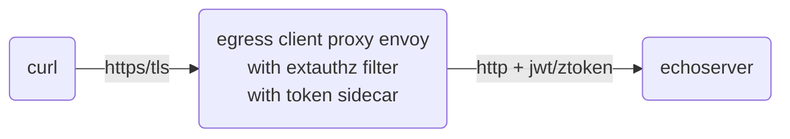

```
kubectl -n athenz exec -it deployment/athenz-cli -c athenz-cli -- /bin/sh -c "curl -sv https://client.athenz.svc.cluster.local/client2echoserver | jq -r .request"
```

### client2extauthz

[Load Test Result](https://ctyano.github.io/athenz-distribution/client2extauthz.html)

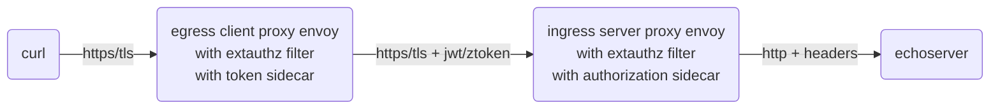

```
kubectl -n athenz exec -it deployment/athenz-cli -c athenz-cli -- /bin/sh -c "curl -sv https://client.athenz.svc.cluster.local/client2extauthz | jq -r .request"
```

### client2extauthzmtls

[Load Test Result](https://ctyano.github.io/athenz-distribution/client2extauthzmtls.html)

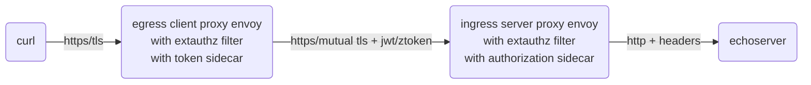

```
kubectl -n athenz exec -it deployment/athenz-cli -c athenz-cli -- /bin/sh -c "curl -sv https://client.athenz.svc.cluster.local/client2extauthzmtls | jq -r .request"
```

### client2authzproxy

[Load Test Result](https://ctyano.github.io/athenz-distribution/client2authzproxy.html)

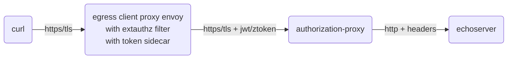

```
kubectl -n athenz exec -it deployment/athenz-cli -c athenz-cli — /bin/sh -c "curl -sv https://client.athenz.svc.cluster.local/client2authzproxy | jq -r .request"
```

### tokensidecar

[Load Test Result](https://ctyano.github.io/athenz-distribution/tokensidecar.html)

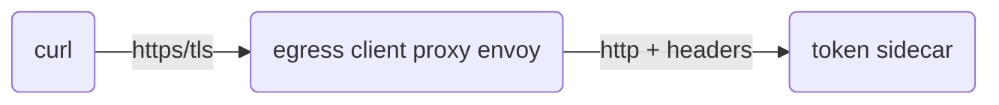

```
kubectl -n athenz exec -it deployment/athenz-cli -c athenz-cli -- /bin/sh -c "curl -sv -H\"X-Athenz-Domain: athenz\" -H\"X-Athenz-Role: envoyclients\" https://client.athenz.svc.cluster.local/tokensidecar | jq -r ."
```

### authorizationsidecar

[Load Test Result](https://ctyano.github.io/athenz-distribution/authorizationsidecar.html)

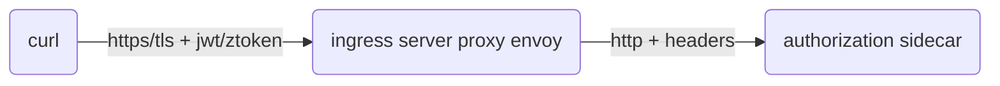

with Role Token:

```
roletoken=$(kubectl -n athenz exec -it deployment/athenz-cli -c athenz-cli -- /bin/sh -c "curl -s -H\"X-Athenz-Domain: athenz\" -H\"X-Athenz-Role: envoyclients\" https://client.athenz.svc.cluster.local/tokensidecar | jq -r .roletoken | xargs echo -n")
```

```
kubectl -n athenz exec -it deployment/athenz-cli -c athenz-cli -- /bin/sh -c "curl -sv -H \"Athenz-Role-Auth: $roletoken\" -H \"X-Athenz-Action: get\" -H \"X-Athenz-Resource: /server\" https://authorizer.athenz.svc.cluster.local/authorizationsidecar | jq -r ."
```

with Access Token:

```
accesstoken=$(kubectl -n athenz exec -it deployment/athenz-cli -c athenz-cli -- /bin/sh -c "curl -s -H\"X-Athenz-Domain: athenz\" -H\"X-Athenz-Role: envoyclients\" https://client.athenz.svc.cluster.local/tokensidecar | jq -r .accesstoken | xargs echo -n")
```

```
kubectl -n athenz exec -it deployment/athenz-cli -c athenz-cli -- /bin/sh -c "curl -sv -H \"Authorization: Bearer $accesstoken\" -H \"X-Athenz-Action: get\" -H \"X-Athenz-Resource: /server\" https://authorizer.athenz.svc.cluster.local/authorizationsidecar | jq -r ."
```

### authzproxy(authorization-proxy)

[Load Test Result](https://ctyano.github.io/athenz-distribution/authzproxy.html)

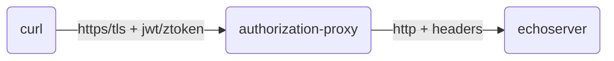

with Role Token:

```
roletoken=$(kubectl -n athenz exec -it deployment/athenz-cli -c athenz-cli -- /bin/sh -c "curl -s -H\"X-Athenz-Domain: athenz\" -H\"X-Athenz-Role: authorization-proxy-clients\" https://client.athenz.svc.cluster.local/tokensidecar | jq -r .roletoken | xargs echo -n")
```

```
kubectl -n athenz exec -it deployment/athenz-cli -c athenz-cli -- /bin/sh -c "curl -sv -H \"Athenz-Role-Auth: $roletoken\" https://authzproxy.athenz.svc.cluster.local/echoserver | jq -r .request"
```

with Access Token:

```
accesstoken=$(kubectl -n athenz exec -it deployment/athenz-cli -c athenz-cli -- /bin/sh -c "curl -s -H\"X-Athenz-Domain: athenz\" -H\"X-Athenz-Role: authorization-proxy-clients\" https://client.athenz.svc.cluster.local/tokensidecar | jq -r .accesstoken | xargs echo -n")
```

```
kubectl -n athenz exec -it deployment/athenz-cli -c athenz-cli -- /bin/sh -c "curl -sv -H \"Authorization: Bearer $accesstoken\" https://authzproxy.athenz.svc.cluster.local/echoserver | jq -r .request"
```

### client2filterauthzmtls

[Load Test Result](https://ctyano.github.io/athenz-distribution/client2filterauthzmtls.html)

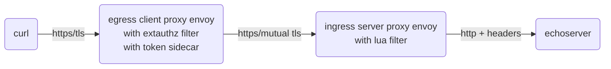

```
kubectl -n athenz exec -it deployment/athenz-cli -c athenz-cli -- /bin/sh -c "curl -sv https://client.athenz.svc.cluster.local/client2filterauthzmtls | jq -r .request"
```

### client2filterauthzjwt

[Load Test Result](https://ctyano.github.io/athenz-distribution/client2filterauthzjwt.html)

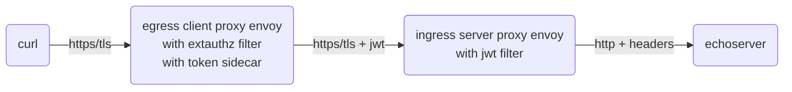

```
kubectl -n athenz exec -it deployment/athenz-cli -c athenz-cli -- /bin/sh -c "curl -sv https://client.athenz.svc.cluster.local/client2filterauthzjwt | jq -r .request"
```

### client2filterauthzmtlsjwt

[Load Test Result](https://ctyano.github.io/athenz-distribution/client2filterauthzmtlsjwt.html)

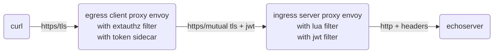

```
kubectl -n athenz exec -it deployment/athenz-cli -c athenz-cli -- /bin/sh -c "curl -sv https://client.athenz.svc.cluster.local/client2filterauthzmtlsjwt | jq -r .request"
```

### envoyjwtfilter(jwt filter/lua filter)

[Load Test Result](https://ctyano.github.io/athenz-distribution/envoyjwtfilter.html)

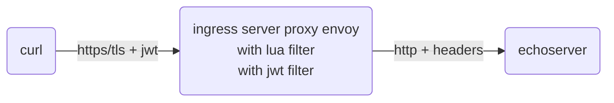

with Access Token:

```
accesstoken=$(kubectl -n athenz exec -it deployment/athenz-cli -c athenz-cli -- /bin/sh -c "curl -s -H\"X-Athenz-Domain: athenz\" -H\"X-Athenz-Role: envoyclients\" https://client.athenz.svc.cluster.local/tokensidecar | jq -r .accesstoken | xargs echo -n")
```

```
kubectl -n athenz exec -it deployment/athenz-cli -c athenz-cli -- /bin/sh -c "curl -sv -H \"Authorization: Bearer $accesstoken\" https://authzenvoy.athenz.svc.cluster.local/jwtauthn | jq -r .request"
```

### client2webhookauthzmtls

[Load Test Result](https://ctyano.github.io/athenz-distribution/client2webhookauthzmtls.html)

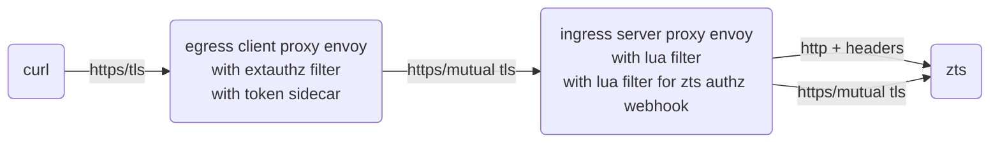

```
kubectl -n athenz exec -it deployment/athenz-cli -c athenz-cli -- /bin/sh -c "curl -sv https://client.athenz.svc.cluster.local/client2webhookauthzmtls | jq -r .request"
```

### client2webhookauthzjwt

[Load Test Result](https://ctyano.github.io/athenz-distribution/client2webhookauthzjwt.html)

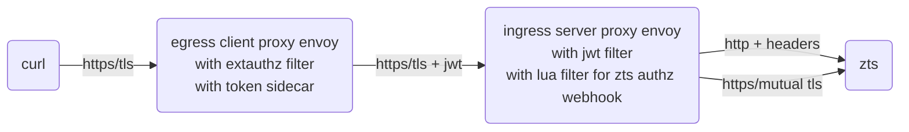

```
kubectl -n athenz exec -it deployment/athenz-cli -c athenz-cli -- /bin/sh -c "curl -sv https://client.athenz.svc.cluster.local/client2webhookauthzjwt | jq -r .request"
```

### client2webhookauthzmtlsjwt

[Load Test Result](https://ctyano.github.io/athenz-distribution/client2webhookauthzmtlsjwt.html)

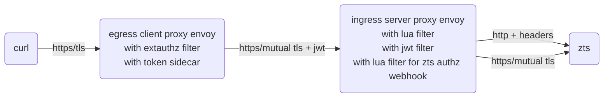

```
kubectl -n athenz exec -it deployment/athenz-cli -c athenz-cli -- /bin/sh -c "curl -sv https://client.athenz.svc.cluster.local/client2webhookauthzmtlsjwt | jq -r .request"
```

### envoywebhook(jwt filter/lua filter/lua filter for zts authz webhook)

[Load Test Result](https://ctyano.github.io/athenz-distribution/envoywebhook.html)

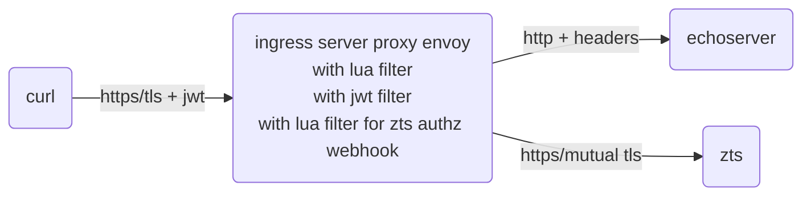

with Access Token:

```
accesstoken=$(kubectl -n athenz exec -it deployment/athenz-cli -c athenz-cli -- /bin/sh -c "curl -s -H\"X-Athenz-Domain: athenz\" -H\"X-Athenz-Role: envoyclients\" https://client.athenz.svc.cluster.local/tokensidecar | jq -r .accesstoken | xargs echo -n")
```

```
kubectl -n athenz exec -it deployment/athenz-cli -c athenz-cli -- /bin/sh -c "curl -sv -H \"Authorization: Bearer $accesstoken\" https://authzwebhook.athenz.svc.cluster.local/echoserver | jq -r .request"
```

### echoserver(client)

[Load Test Result](https://ctyano.github.io/athenz-distribution/echoserver.client.html)

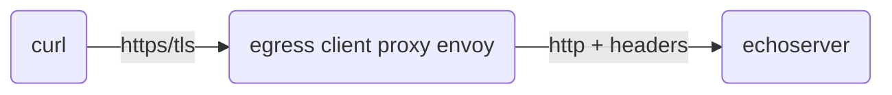

```
kubectl -n athenz exec -it deployment/athenz-cli -c athenz-cli -- /bin/sh -c "curl -sv https://client.athenz.svc.cluster.local/echoserver | jq -r .request"
```

### echoserver(authorizer)

[Load Test Result](https://ctyano.github.io/athenz-distribution/echoserver.authorizer.html)

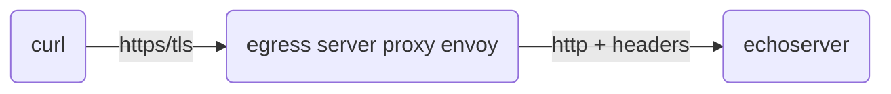

```
kubectl -n athenz exec -it deployment/athenz-cli -c athenz-cli -- /bin/sh -c "curl -sv https://authorizer.athenz.svc.cluster.local/echoserver | jq -r .request"
```

### zms(authorization management service)

[Load Test Result](https://ctyano.github.io/athenz-distribution/zms.html)

[](https://editor.plantuml.com/uml/JOux3eD030Lxd-A97gLF4V4voGeSMCdi8jkB0gT7K4HqJ_EccCOyg9T5IFZhy0oDq-mOe_BWCIUYQuGq2QCQYag5O6YVb2TbCmmIEJbMpRyTdBQytshtL8FFd0uSYy5ODzPRwObQrFK77TwOtLTxkHXrD-l_R2bUWk2wgE4qNjKd)

```
kubectl -n athenz exec -it deployment/athenz-cli -c athenz-cli -- /bin/sh -c "curl -sv https://client.athenz.svc.cluster.local/zms/v1/domain/sys.auth/service | jq -r ."
```

### zts(authorization token service)

[Load Test Result](https://ctyano.github.io/athenz-distribution/zts.html)

[](https://editor.plantuml.com/uml/JOux3eD030Lxd-A97gLF4V4voGeSMCdi8jkB0gT7K4HqJ_EccCOyg9T5IFZhy0oDq-mOe_BWCIUYQuGq2QCQYag5O6YVb2TbCmmIEJbMpRyTdBQytshtL8FFd0uSRZ3MZVLMUg8MTVr1XpTczzLUBaRTpVe_MugN8BWkQZYDL_K9)

```
kubectl -n athenz exec -it deployment/athenz-cli -c athenz-cli -- /bin/sh -c "curl -sv https://client.athenz.svc.cluster.local/zts/v1/domain/sys.auth/service | jq -r ."
```

### client(metrics)

prometheus metrics

[](https://editor.plantuml.com/uml/JOun2iCm40JxUyNYtgXF4Mo_8usGBv90FXdTASI_jvqgtJ0moqvglbdV2XL-6woYvPWCQsuSB5SXki5BB8mXz5O6UCNyRpasLaKecSMmj_ezmFAfnqlSDM_gBhUn9UxwgnUY6UFun887ajckpeeIJIphVUK4)

```
kubectl -n athenz exec -it deployment/athenz-cli -c athenz-cli -- /bin/sh -c "curl -sv https://client.athenz.svc.cluster.local/stats/prometheus"
```

### server(metrics)

prometheus metrics

[](https://editor.plantuml.com/uml/JOun3eCm40JxUyMA7hbF4G7lI6F11LioPtHtHk7tWLJfHYFDQWVpgDwsGeNV3g_Gl2R7afLdprM8ReYo5aOtDoqTec7yjrbMPJCOwy6ANUld1CjHpvU4QzyjN6vZJzpibqz48_h-YGaF9FVTWXSZ6bYM-yiN)

```
kubectl -n athenz exec -it deployment/athenz-cli -c athenz-cli -- /bin/sh -c "curl -sv https://authorizer.athenz.svc.cluster.local/stats/prometheus"
```

