# Envoy Ambassador Instruction for Kubernetes

## Deployment Instructions

### [athenz-identityprovider](../kubernetes/athenz-identityprovider)

Envoy configuration: [config.yaml](../kubernetes/athenz-identityprovider/kustomize/envoy/config.yaml)

### [athenz-authorizer](../kubernetes/athenz-authorizer)

Envoy configuration: [config.yaml](../kubernetes/athenz-authorizer/kustomize/envoy/config.yaml)

### [athenz-client](../kubernetes/athenz-client)

Envoy configuration: [config.yaml](../kubernetes/athenz-client/kustomize/envoy/config.yaml)

## How to try them out

### client2server

[Load Test Result](https://ctyano.github.io/athenz-distribution/client2server.html)

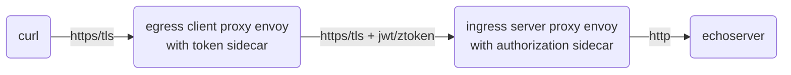

```
kubectl -n athenz exec -it deployment/athenz-cli -c athenz-cli -- /bin/sh -c "curl -s https://client.athenz.svc.cluster.local/client2server | jq -r .request"
```

### client2servermtls

[Load Test Result](https://ctyano.github.io/athenz-distribution/client2servermtls.html)

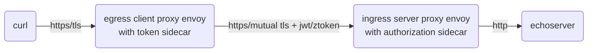

```
kubectl -n athenz exec -it deployment/athenz-cli -c athenz-cli -- /bin/sh -c "curl -s https://client.athenz.svc.cluster.local/client2servermtls | jq -r .request"
```

### client2authzproxy

[Load Test Result](https://ctyano.github.io/athenz-distribution/client2authzproxy.html)

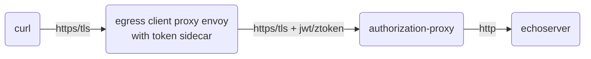

```
kubectl -n athenz exec -it deployment/athenz-cli -c athenz-cli — /bin/sh -c "curl -s https://client.athenz.svc.cluster.local/client2authzproxy | jq -r .request"
```

### tokensidecar

[Load Test Result](https://ctyano.github.io/athenz-distribution/tokensidecar.html)

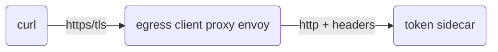

```
kubectl -n athenz exec -it deployment/athenz-cli -c athenz-cli -- /bin/sh -c "curl -sv -H\"X-Athenz-Domain: athenz\" -H\"X-Athenz-Role: envoyclients\" https://client.athenz.svc.cluster.local/tokensidecar | jq -r ."
```

### authorizationsidecar

[Load Test Result](https://ctyano.github.io/athenz-distribution/authorizationsidecar.html)

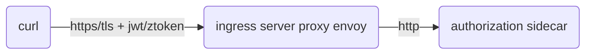

with Role Token:

```
roletoken=$(kubectl -n athenz exec -it deployment/athenz-cli -c athenz-cli -- /bin/sh -c "curl -s -H\"X-Athenz-Domain: athenz\" -H\"X-Athenz-Role: envoyclients\" https://client.athenz.svc.cluster.local/tokensidecar | jq -r .roletoken" | xargs echo -n)
```

```
kubectl -n athenz exec -it deployment/athenz-cli -c athenz-cli -- /bin/sh -c "curl -sv -H \"Athenz-Role-Auth: $roletoken\" -H \"X-Athenz-Action: get\" -H \"X-Athenz-Resource: /server\" https://authorizer.athenz.svc.cluster.local/authorizationsidecar | jq -r .request"
```

with Access Token:

```
accesstoken=$(kubectl -n athenz exec -it deployment/athenz-cli -c athenz-cli -- /bin/sh -c "curl -s -H\"X-Athenz-Domain: athenz\" -H\"X-Athenz-Role: envoyclients\" https://client.athenz.svc.cluster.local/tokensidecar | jq -r .accesstoken" | xargs echo -n)
```

```
kubectl -n athenz exec -it deployment/athenz-cli -c athenz-cli -- /bin/sh -c "curl -sv -H \"Authorization: Bearer $accesstoken\" -H \"X-Athenz-Action: get\" -H \"X-Athenz-Resource: /server\" https://authorizer.athenz.svc.cluster.local/authorizationsidecar | jq -r .request"
```

### authzproxy(authorization-proxy)

[Load Test Result](https://ctyano.github.io/athenz-distribution/authzproxy.html)

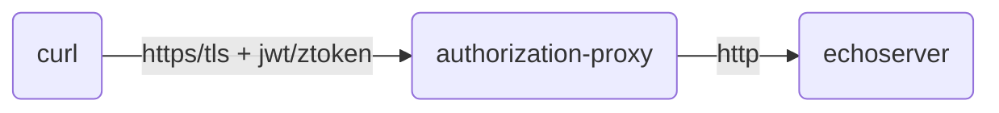

with Role Token:

```
roletoken=$(kubectl -n athenz exec -it deployment/athenz-cli -c athenz-cli -- /bin/sh -c "curl -s -H\"X-Athenz-Domain: athenz\" -H\"X-Athenz-Role: authorization-proxy-clients\" https://client.athenz.svc.cluster.local/tokensidecar | jq -r .roletoken" | xargs echo -n)
```

```
kubectl -n athenz exec -it deployment/athenz-cli -c athenz-cli -- /bin/sh -c "curl -sv -H \"Athenz-Role-Auth: $roletoken\" https://authzproxy.athenz.svc.cluster.local/echoserver | jq -r .request"
```

with Access Token:

```
accesstoken=$(kubectl -n athenz exec -it deployment/athenz-cli -c athenz-cli -- /bin/sh -c "curl -s -H\"X-Athenz-Domain: athenz\" -H\"X-Athenz-Role: authorization-proxy-clients\" https://client.athenz.svc.cluster.local/tokensidecar | jq -r .accesstoken" | xargs echo -n)
```

```
kubectl -n athenz exec -it deployment/athenz-cli -c athenz-cli -- /bin/sh -c "curl -sv -H \"Authorization: Bearer $accesstoken\" https://authzproxy.athenz.svc.cluster.local/echoserver | jq -r .request"
```

### client2echoserverjwt

[Load Test Result](https://ctyano.github.io/athenz-distribution/client2echoserverjwt.html)

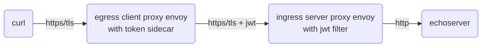

```
kubectl -n athenz exec -it deployment/athenz-cli -c athenz-cli -- /bin/sh -c "curl -s https://client.athenz.svc.cluster.local/client2echoserverjwt | jq -r .request"
```

### client2echoservermtls

[Load Test Result](https://ctyano.github.io/athenz-distribution/client2echoservermtls.html)

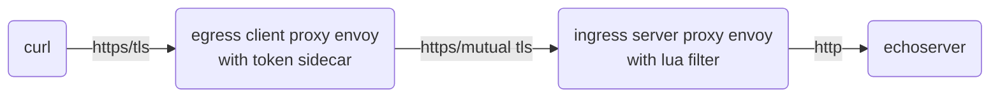

```
kubectl -n athenz exec -it deployment/athenz-cli -c athenz-cli -- /bin/sh -c "curl -s https://client.athenz.svc.cluster.local/client2echoservermtls | jq -r .request"
```

### client2echoserver

[Load Test Result](https://ctyano.github.io/athenz-distribution/client2echoserver.html)

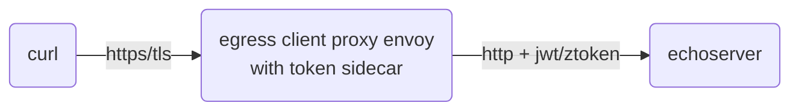

```
kubectl -n athenz exec -it deployment/athenz-cli -c athenz-cli -- /bin/sh -c "curl -s https://client.athenz.svc.cluster.local/client2echoserver | jq -r .request"
```

### echoserver(client)

[Load Test Result](https://ctyano.github.io/athenz-distribution/echoserver.client.html)

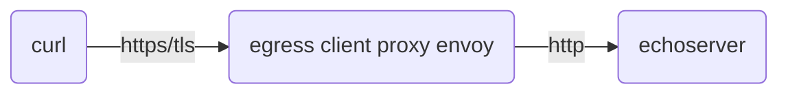

```
kubectl -n athenz exec -it deployment/athenz-cli -c athenz-cli -- /bin/sh -c "curl -sv https://client.athenz.svc.cluster.local/echoserver | jq -r .request"
```

### echoserver(authorizer)

[Load Test Result](https://ctyano.github.io/athenz-distribution/echoserver.authorizer.html)

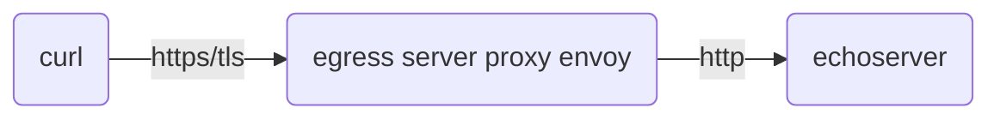

```
kubectl -n athenz exec -it deployment/athenz-cli -c athenz-cli -- /bin/sh -c "curl -sv https://authorizer.athenz.svc.cluster.local/echoserver | jq -r .request"
```

### zms

[Load Test Result](https://ctyano.github.io/athenz-distribution/zms.html)

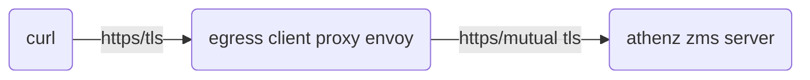

```
kubectl -n athenz exec -it deployment/athenz-cli -c athenz-cli -- /bin/sh -c "curl -sv https://client.athenz.svc.cluster.local/zms/v1/domain/sys.auth/service | jq -r ."
```

### zts

[Load Test Result](https://ctyano.github.io/athenz-distribution/zts.html)

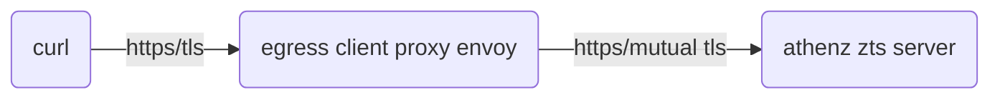

```
kubectl -n athenz exec -it deployment/athenz-cli -c athenz-cli -- /bin/sh -c "curl -sv https://client.athenz.svc.cluster.local/zts/v1/domain/sys.auth/service | jq -r ."
```

### client(metrics)

prometheus metrics

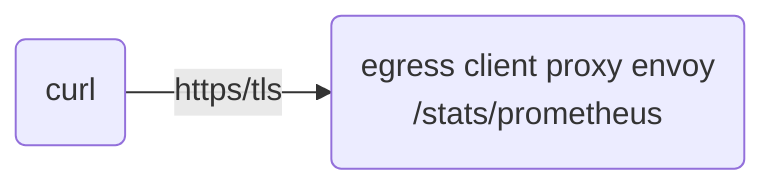

```
kubectl -n athenz exec -it deployment/athenz-cli -c athenz-cli -- /bin/sh -c "curl -s https://client.athenz.svc.cluster.local/stats/prometheus"
```

### server(metrics)

prometheus metrics

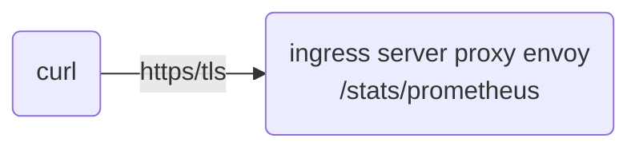

```
kubectl -n athenz exec -it deployment/athenz-cli -c athenz-cli -- /bin/sh -c "curl -s https://authorizer.athenz.svc.cluster.local/stats/prometheus"
```
