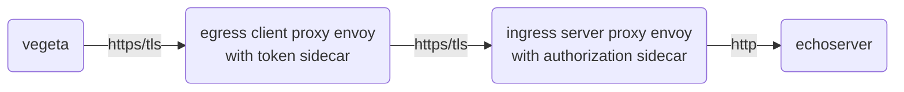
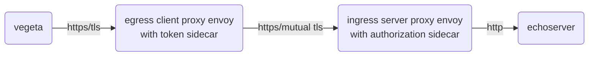
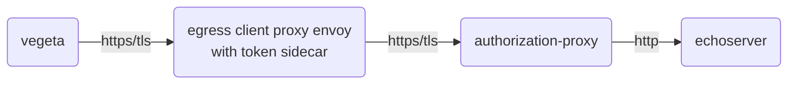

# Vegeta Instruction for Kubernetes

## How to setup

```
DOCKER_REGISTRY=ghcr.io/ctyano
kustomize edit set image ghcr.io/ctyano/docker-vegeta:latest=${DOCKER_REGISTRY:-ghcr.io/ctyano/}docker-vegeta:latest
kubectl apply -k .
```

## How to try them out

### client2server



```
kubectl -n athenz exec pod/vegeta -- /bin/sh -c "echo 'GET https://client.athenz.svc.cluster.local/client2server' | vegeta attack -workers=100 -rate=100 -duration=30s -keepalive false" > /tmp/results.bin
```

### client2servermtls



```
kubectl -n athenz exec pod/vegeta -- /bin/sh -c "echo 'GET https://client.athenz.svc.cluster.local/client2servermtls' | vegeta attack -workers=100 -rate=100 -duration=30s -keepalive false" > /tmp/results.bin
```

### client2authzproxy



```
kubectl -n athenz exec pod/vegeta -- /bin/sh -c "echo 'GET https://client.athenz.svc.cluster.local/client2authzproxy' | vegeta attack -workers=100 -rate=100 -duration=30s -keepalive false" > /tmp/results.bin
```

## How to see results

```
cat /tmp/results.bin | vegeta plot > /tmp/vegeta.html && open /tmp/vegeta.html 
```

```
cat /tmp/results.bin | vegeta report 
```
